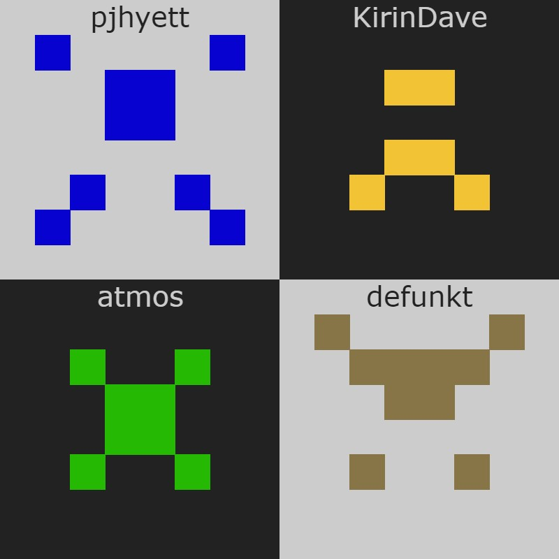

# 🎨 Profile Picture from Username
* Generate unique profile picture from username and use it everywhere with connecting Flask server.
* :octocat: Inspired from GitHub itself.

## 🐍 Librarys I used
* Pillow
* Flask

## 🧐 How to use
* First clone the repo.
```bash
$ git clone https://github.com/orhanemree/profile-picture-from-username.git
$ cd profile-picture-from-username
$ pip install -r requirements.txt
```
* Start Flask server.
```bash
$ python app.py
```
* You can use the profile picture simply connecting ``localhost:5500/<username>`` from any language you choose.

## 🔎 Examples
* http://localhost:5500/pjhyett
* http://localhost:5500/KirinDave
* http://localhost:5500/atmos
* http://localhost:5500/defunkt



## ✨ Features
* [x] Return profile picture without saving with data url.
* [x] Generate unique profile picture for every username.
* [x] Set fill_color from first 3 chars of username and adjust contrast.

## 📃 License
* Licensed under [MIT License](https://github.com/orhanemree/profile-picture-from-username/blob/master/LICENSE).